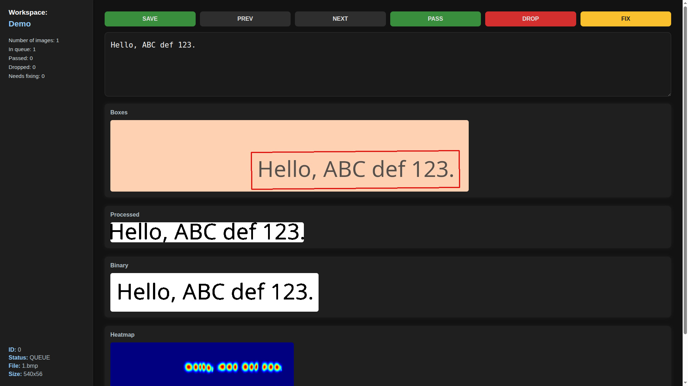

# Simple Image Text Label

A Tool for filtering and labeling images in a handwritten text dataset.



This repository serves as a web server built with Flask, designed to render a web interface for reviewing the results of dataset cleaning or pre-processing. It helps users determine whether each dataset entry is usable, needs correction, or should be discarded.

Users can view images, edit labels, and assign a status to each item. When a user updates the text or sets the status of an item, the `save` method is triggered to persist the changes.

In the provided example, the implementation of `save` writes the results back to a CSV file, adding a `status` column to each row. This data can then be used in subsequent processing steps.

## Features

- Web-based UI accessible via browser
- Displays images and allows label editing, with file handling logic defined in sitl_handler.py
- Organizes the dataset into four categories: QUEUE, PASS, DROP, and FIX

## Usage

```sh
python -m venv venv
source ./venv/bin/activate
pip install -r requirements.txt
python -m sitl --handler sitl_handler.py
```

## Handler Implementation

Implements operations through class inheritance.

- `name`: Workspace name
- `__len__`: Returns the number of items in the dataset
- `next_queue`: Returns the ID of the next item with QUEUE status
- `get`: Returns the item object
- `set`: Updates the status and text of an item
- `stats`: Returns dataset filtering statistics
- `save`: Saves the current changes

You can find more details in the source code at [sitl/handler.py](./sitl/handler.py)

Example implementation using a CSV file [sitl_handler.py](./sitl_handler.py)

- `sitl.SITLHandler`: A base class to inherit from for defining dataset operations
- `sitl.ImageStatus`: An enumeration representing the status of an image

    | Status  | Description                     |
    | ------- | ------------------------------- |
    | `QUEUE` | Waiting for review or filtering |
    | `PASS`  | Approved                        |
    | `DROP`  | Discarded                       |
    | `FIX`   | Usable, but requires correction |

- `sitl.Item`: A NamedTuple used to return information about an individual item
- `sitl.Stats`: A TypedDict that returns statistics about how many items have been filtered so far
